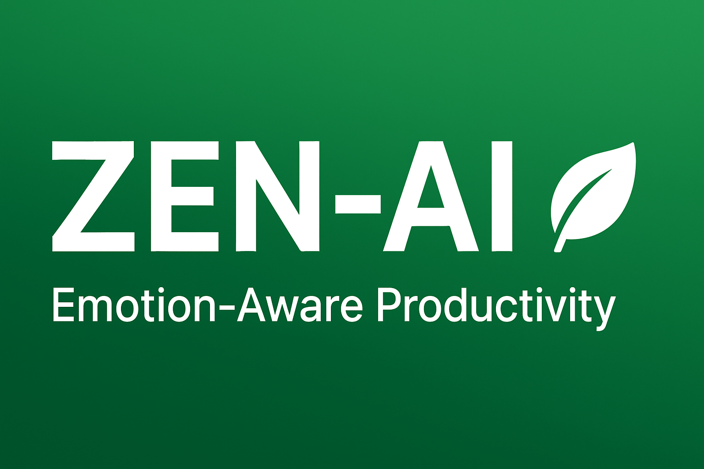
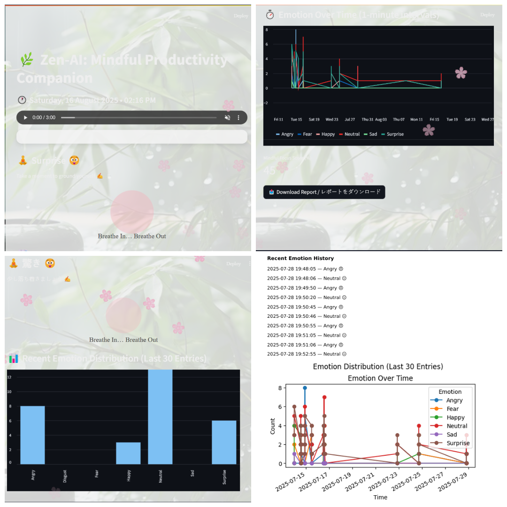

<div align="center">



# 🌿 Zen-AI  
### *Emotion-Aware Productivity App Using AI*  


---

✨ *Build productivity. Respect emotions. Stay Zen.* ✨  

[](https://share.streamlit.io/your-username/zen_ai_app)

</div>

---

## 🌟 Vision  
> *Zen-AI adjusts your workflow based on your emotions, helping you stay focused, balanced, and mindful.*

---

## 🖼️ Overview  
Here’s a **collage screenshot** showing all major components of Zen-AI in one view:  

  

---

## ⚙️ Features  
✅ Real-time emotion detection via webcam and voice 🎥🎙️  
✅ Personalized productivity suggestions ✨  
✅ Mood tracking and analytics 📊  
✅ AI-powered task prioritization 🧠  
✅ Mindfulness reminders and workflow adjustments 🌿  

---

## 🧐 Tech Stack  
- **Languages & Frameworks:** 🐍 Python, Streamlit  
- **AI & ML:** 🤖 TensorFlow/Keras, OpenCV, Librosa  
- **Data & Visualization:** 📊 Pandas, Matplotlib  
- **Deployment:** ☁️ Streamlit Cloud / Local  

---

## 💻 Installation  

Clone the repo:
```bash
git clone https://github.com/Shafiyaqureshi90/zen_ai_app.git
cd zen_ai_app
pip install -r requirements.txt
streamlit run app.py

---

📂 Project Structure

zen_ai_app/
│
├─ app.py                     # Main Streamlit application
├─ requirements.txt           # Python dependencies
├─ README.md                  # Project documentation
├─ fonts/                     # Custom fonts used in app
│   └─ DejaVuSans.ttf
├─ assets/                    # Images, GIFs, icons
│   ├─ images/
│   │   └─ zen_ai_collage.png
│   └─ gifs/
├─ src/                       # Core Python modules
│   ├─ emotion_detection.py
│   ├─ utils.py
├─ data/                      # Any datasets or logs
│   └─ sample_data.csv
├─ docs/                      # Diagrams & documentation
│   └─ zen_ai_architecture.png
```
Author

Made by Md Shafiya Begum


